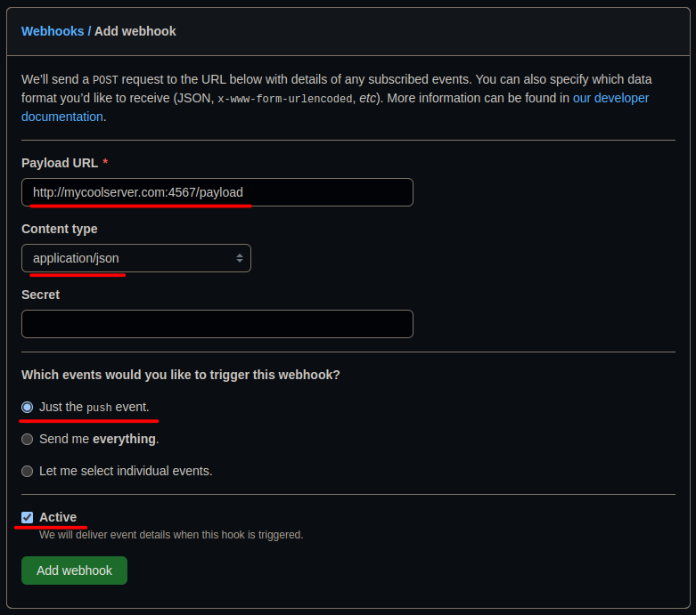

# pullbot
A python script that automatically pulls a git branch when someone pushes to it.

# Github Setup
1. Add a webhook to your repo
  - 
2. Create a ssh key on your server __that has no passphase__
3. Add the ssh key as a read-only deploy key to your repo
  - 

# Running The Server
Edit the following variables in the `pullbot.sh` script to match your setup.
```bash
SSH_DEPLOY_KEY_PATH=/home/user/.ssh/my-deploy-key
REPO_DIR=/home/user/git/my-repo/
GIT_BRANCH=master
```

To run the server, simply do `./pullbot.sh`.

If you want to run the server headless (with no shell), do `nohup ./pullbot.sh &`.