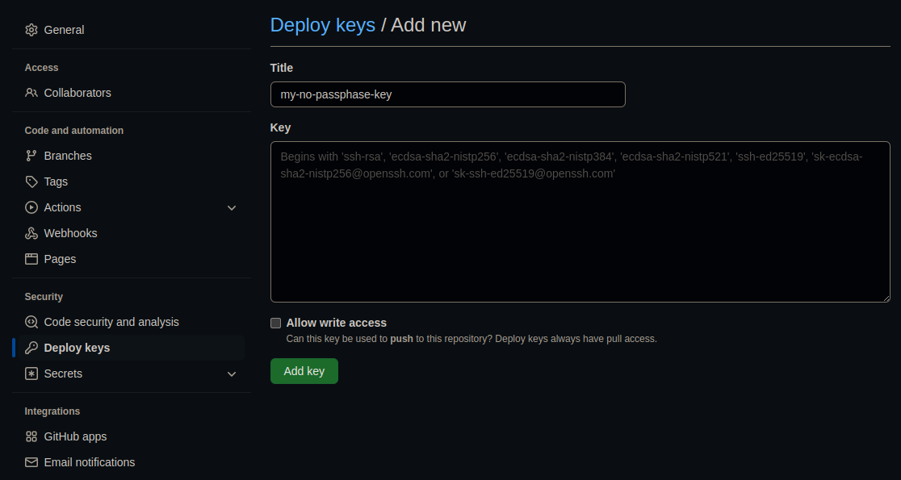

# pullbot
A python script that automatically pulls a git branch when someone pushes to it.

# Github Setup
For the script to be able to pull from the repo, you need to setup some things.

1. Add a webhook to your repo
  - 
2. [Create an ssh key](https://docs.github.com/en/authentication/connecting-to-github-with-ssh/generating-a-new-ssh-key-and-adding-it-to-the-ssh-agent) on your server.
  - __make sure it has has no passphase__
3. Add the ssh key as a read-only deploy key to your repo
  - 

# Running The Server
Edit the following variables in the `pullbot.sh` script to match your setup.
```sh
SSH_DEPLOY_KEY_PATH=/home/user/.ssh/my-deploy-key
REPO_DIR=/home/user/git/my-repo/
GIT_BRANCH=master
```

To run the server, simply do `./pullbot.sh`.

If you want to run the server headless (with no shell), do `nohup ./pullbot.sh &`.